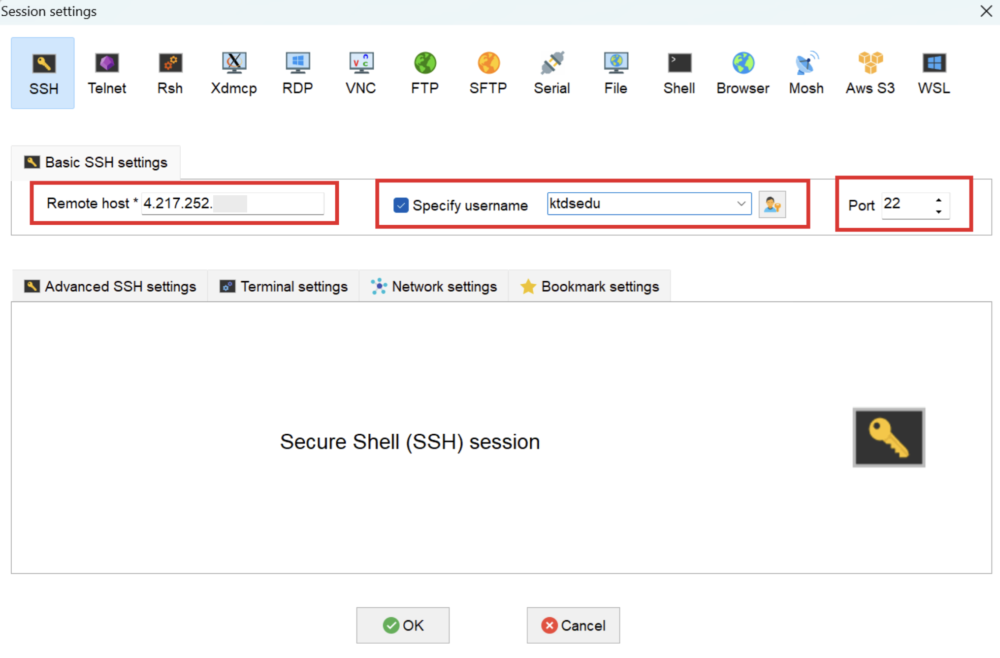

# < 시작전에 >


# 1. 실습 환경 준비(개인PC)


## 1) mobaXterm 설치

Cloud VM에 접근하기 위해서는 터미널이 필요하다.

CMD / PowerShell / putty 와 같은 기본 터미널을 이용해도 되지만 좀더 많은 기능이 제공되는 MobaxTerm(free 버젼) 을 다운로드 하자.


- download 위치
  - 링크: https://download.mobatek.net/2522025040602403/MobaXterm_Installer_v25.2.zip

- mobaxterm 실행


## 2) gitbash 설치

교육문서를 다운로드 받으려면 Git Command 가 필요하다. Windows 에서는 기본 제공되지 않아 별도 설치 해야 한다.

- 다운로드 주소 : https://github.com/git-for-windows/git/releases/download/v2.45.2.windows.1/Git-2.45.2-64-bit.exe
- 참조 링크 : https://git-scm.com/


## 3) Typora 설치

교육자료(MarkDown 문서)를 typora로 확인하기 위해 Typora를 설치한다. 

github site 를 직접 확인해도 되긴 하지만 각종 실습 자료를 직접 수정해야 하므로 가능한 Typora 를 이용하자.


### (1) Typora 설치

- 참고
  - 링크: https://typora.io/

- download 위치
  - 다운로드주소 : https://download.typora.io/windows/typora-setup-x64.exe

- Typora 실행


### (2) Typora 환경설정

원할한 실습을 위해 코드펜스 옵션을 아래와 같이 변경하자.

- 코드펜스 설정
  - 메뉴 : 파일 > 환경설정 > 마크다운 > 코드펜스
    - 코드펜스에서 줄번호 보이기 - check
    - 긴문장 자동 줄바꿈 : uncheck


- 개요보기 설정
  - 메뉴 : 보기 > 개요
    - 개요 : check


# 2. 교육문서 Download

실습을 위해서 해당 자료를 download 하여 markdown 전용 viewer 인 Typora 로 오픈하여 실습에 참여하자.


## 1) 개인 PC에 교육자료 download

gitbash 실행후 command 명령어로 아래와 같이 디렉토리를 생성후 git clone 으로 download 하자.

```sh
## githubrepo directory 생성
$ mkdir -p /c/githubrepo

$ cd /c/githubrepo

$ git clone https://github.com/ssongman/ktds-edu-k8s-istio.git
Cloning into 'ktds-edu-k8s-istio'...
remote: Enumerating objects: 597, done.
remote: Counting objects: 100% (32/32), done.
remote: Compressing objects: 100% (12/12), done.
remote: Total 597 (delta 22), reused 28 (delta 20), pack-reused 565
Receiving objects: 100% (597/597), 3.85 MiB | 9.97 MiB/s, done.
Resolving deltas: 100% (326/326), done.


$ ll /c/githubrepo
drwxr-xr-x 1 송양종 197121 0 Jun  6 11:06 ktds-edu-k8s-istio/

```


만약 교육중 자료가 변경(오타 변경 등의 사유로) 되어 다시 받아야 하는 경우 가 있을 경우 해당 위치에서 git pull 만 다시 받도록 하자.

```sh
$ cd /c/githubrepo/ktds-edu-k8s-istio

$ git pull

```


## 2) Typora 로 readme.md 파일오픈

- typora 로 오픈
  - 파일열기(Ctrl + O)  후 아래 파일 오픈


```sh
## typora 에서 아래 파일 오픈

C:\githubrepo\ktds-edu-k8s-istio\README.md
```


# 3. 실습 환경 준비(Cloud)

본 교육 과정에서의 모든 실습은 Cloud 에서 수행할 것이다.


## 1) 개인 VM 서버 주소 확인- ★

원할한 실습을 위해서 개인별 한개씩 VM 이 할당되어 있다.  해당 노드에 kubernetes 를 설치 및 다양한 실습을 진행할 것이다.

수강생별 개인 VM Server 접속 주소를 확인하자. 또한 KtdsEduCluster 에서 사용할 개인별 Namespace 를 확인하자.

| NO   | 이름   | 팀              | Email                | VM Server | VM Server IP  | Namespace |
| ---- | ------ | --------------- | -------------------- | --------- | ------------- | --------- |
| 1    | 송양종 | 강사            |                      | eduVM01   |               | user01    |
| 2    | 송양종 | 강사            |                      | eduVM02   |               | user02    |
| 3    | 권석원 | 전략운영팀      | seokwon.kwon@kt.com  | eduVM03   | 4.230.25.56   | user03    |
| 4    | 김승미 | IA Core2팀      | soomee.kim@kt.com    | eduVM04   | 4.230.24.184  | user04    |
| 5    | 김용기 | Cloud매니지드팀 | brave.kim@kt.com     | eduVM05   | 4.230.41.87   | user05    |
| 6    | 김재중 | Cloud매니지드팀 | jaejung.kim@kt.com   | eduVM06   | 20.39.203.122 | user06    |
| 7    | 김재천 | 인프라컨설팅팀  | kim.jaecheon@kt.com  | eduVM07   | 20.41.79.146  | user07    |
| 8    | 김지영 | Cloud매니지드팀 | jeeeyoung.kim@kt.com | eduVM08   | 4.217.234.52  | user08    |
| 9    | 김지훈 | IA Core2팀      | jihun094.kim@kt.com  | eduVM09   | 20.214.240.21 | user09    |
| 10   | 김하성 | 전략개발팀      | haseong.kim@kt.com   | eduVM10   | 4.217.248.113 | user10    |
| 11   | 김한길 | ICT Core Eng팀  | one.way@kt.com       | eduVM11   | 20.39.201.109 | user11    |
| 12   | 백연희 | 통신AX개발팀    | yh.baek@kt.com       | eduVM12   | 4.217.250.119 | user12    |
| 13   | 백지영 | 통신AX개발팀    | dasop@kt.com         | eduVM13   | 4.217.184.168 | user13    |
| 14   | 백지원 | Cloud매니지드팀 | jiwon.baek@kt.com    | eduVM14   | 20.196.107.57 | user14    |
| 15   | 변성도 | AI플랫폼개발팀  | seongdo.byun@kt.com  | eduVM15   | 4.217.217.187 | user15    |
| 16   | 이채원 | Cloud컨설팅팀   | chae-won.lee@kt.com  | eduVM16   | 4.217.194.162 | user16    |
| 17   | 임진영 | Cloud수행팀     | jinyoung.lim@kt.com  | eduVM17   | 4.230.26.40   | user17    |
| 18   | 장선후 | Cloud매니지드팀 | jang.sh@kt.com       | eduVM18   | 4.230.26.67   | user18    |


## 2) SSH (Mobaxterm) 실행

Mobaxterm 을 실행하여 VM 접속정보를 위한 신규 session 을 생성하자.

- 메뉴
  - session  : 상단 좌측아이콘 클릭

  - SSH : 팝업창 상단 아이콘 클릭




빨간색 영역을 주의해서 입력한후 접속하자.


- Romote host
  - 개인별로 접근 주소가 다르므로 위 수강생별  VM  Server IP 주소를 확인하자.
  - ex)  bastion03 : 4.217.252.xxx  (샘플)

- User
  - Specify username 에 Check
  - User : ktdsedu입력
    - Password 는 별도 공지
  
- Port : 22


